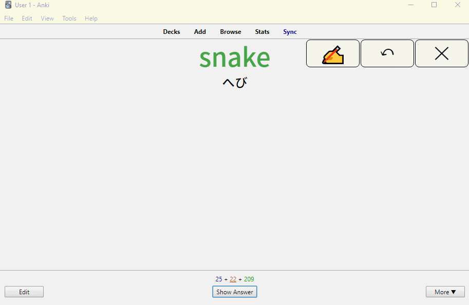
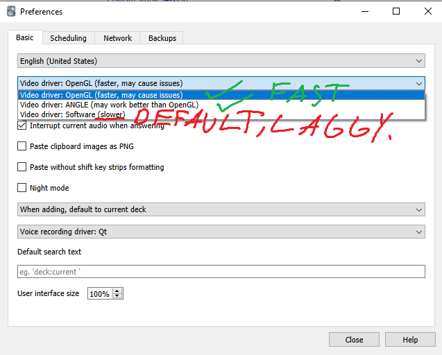
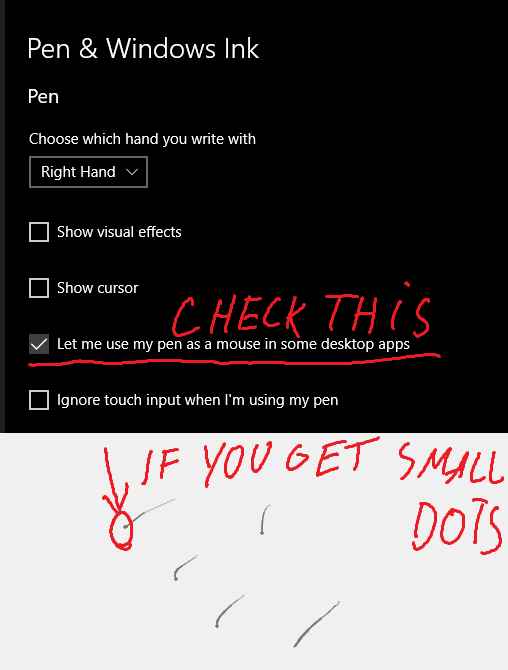

# Anki-StylusDraw
Improvements upon the Anki-TouchScreen addon to add pressure pen functionality.

Website to test the drawing functionality: https://rytisgit.github.io/Anki-StylusDraw/

  

# Changes
* Added pressure sensitivity
* Increased drawing speed
* Added <kbd>,</kbd> for showing/hiding and <kbd>.</kbd> for clearing
* Added standalone website to test drawing
* Work around a Windows Pen bug which makes 2 primary pointers appear when drawing in Anki

## My hardware
I use a Huion H1161 with Windows Pen enabled and it works perfectly.
### For best exprience dont use software rendering and turn on use pen as a mouse
<table><tr>
<td>  </td>
<td>  </td>
</tr></table>

# Old Description
  
Implements same drawing/writing mechanism as in AnkiDroid. Your writing is NOT intended to remain on the cards after review - same as in AnkiDroid.

Use the menu `View` → `TouchScreen` to activate/change settings.

Use <kbd>Ctrl</kbd> + <kbd>R</kbd> to toggle the touchscreen.

Use icons which will show up in the top right corner of the review screen to temporarily hide/clean the board.
Enjoy!

Warning: the version for Anki 2.0 has limited functionality, and may sometimes not work as expected; since the release of Anki 2.1, the old version is not supported.

#### Changelog:
- 0.2.6 - make "undo" action available under <kbd>Alt</kbd> + <kbd>Z</kbd>
- 0.2.4 - add support for enhanced image occlusion, add a fix for "a double click bug" by LaucianK 
- 0.2.3 - bug fix release, improvements to undo button, styling and performance
- 0.2.1 - minor fix for the buttons/canvas positioning
- 0.2 - added "undo" option, improved the support of long cards plus other minor improvements

#### Disclaimer
Important parts of Javascript code were inspired by <a href="http://creativejs.com/tutorials/painting-with-pixels/index.html" rel="nofollow">creativejs tutorial</a>. I recommend you check out the resource if you are interested in learning JS.

This add-on works well with <a href="https://ankiweb.net/shared/info/1496166067">Anki Night Mode</a>.

#### For developers
You are more than welcome to contribute! While I may not be able to support every user of this addon, I will do my best to help any developer willing to open PR implementing new features or fixing bugs.
